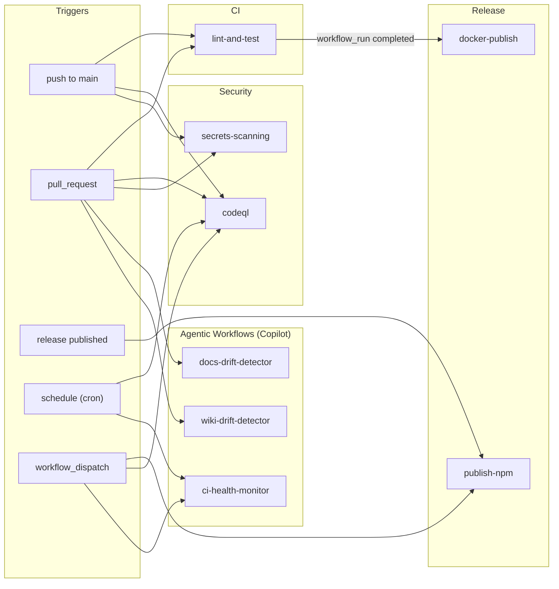

# CI/CD Workflows

> **Value Proposition**
> Supercharge your development lifecycle. Automate CI/CD effortlessly. Secure your code instantly. Deploy to Docker and npm seamlessly. Experience reliable, rapid releases. Accelerate velocity with AI drift detection.

This directory contains all GitHub Actions workflows for **mysql-mcp**. The pipeline features three high-performance layers: continuous integration, security scanning, and automated publishing.

## Workflow Map



---

## Workflows

### CI

| File                                 | Trigger                 | Purpose                                                                                                  |
| ------------------------------------ | ----------------------- | -------------------------------------------------------------------------------------------------------- |
| [lint-and-test.yml](lint-and-test.yml) | push to `main` / PR    | Lint, typecheck, build, unit tests (Node 24.x + 25.x matrix), pnpm audit, Docker smoke test (build + HTTP start) |

### Security

| File                                       | Trigger                                   | Purpose                                                               |
| ------------------------------------------ | ----------------------------------------- | --------------------------------------------------------------------- |
| [codeql.yml](codeql.yml)                   | push (JS/TS) / PR / weekly / manual       | CodeQL static analysis for `javascript-typescript` (security-extended) |
| [secrets-scanning.yml](secrets-scanning.yml) | push to `main` / PR                      | TruffleHog (verified secrets) + Gitleaks scanning                     |

### Release & Publishing

| File                                       | Trigger                                            | Purpose                                                                                                                                           |
| ------------------------------------------ | -------------------------------------------------- | ------------------------------------------------------------------------------------------------------------------------------------------------- |
| [docker-publish.yml](docker-publish.yml)   | `workflow_run` from lint-and-test (on `main`)       | Security scan (Docker Scout + Trivy), smoke test, multi-arch build (amd64 + arm64), manifest merge, Docker Hub description update                 |
| [publish-npm.yml](publish-npm.yml)         | release published / manual                          | Version verification, build, publish to npm with `--provenance` (SLSA Build L3)                                                                   |

### Agentic Workflows (GitHub Copilot)

These are AI-powered workflows using [GitHub Copilot Coding Agent](https://docs.github.com/en/copilot/using-github-copilot/using-copilot-coding-agent-to-work-on-tasks/about-assigning-tasks-to-copilot). Each `.md` file contains the agent prompt; the corresponding `.lock.yml` is the auto-generated compiled workflow (**do not edit `.lock.yml` files**).

| Prompt                                           | Lock File                                                    | Schedule               | Purpose                                                                                 |
| ------------------------------------------------ | ------------------------------------------------------------ | ---------------------- | --------------------------------------------------------------------------------------- |
| [ci-health-monitor.md](ci-health-monitor.md)     | [ci-health-monitor.lock.yml](ci-health-monitor.lock.yml)     | Wed 14:00 UTC / manual | Audits workflows for deprecated actions, Node.js runtime issues, stale Dependabot config |
| [docs-drift-detector.md](docs-drift-detector.md) | [docs-drift-detector.lock.yml](docs-drift-detector.lock.yml) | PR (on code changes)   | Audits README, DOCKER_README, CONTRIBUTING for drift against code changes                |
| [wiki-drift-detector.md](wiki-drift-detector.md) | [wiki-drift-detector.lock.yml](wiki-drift-detector.lock.yml) | PR (on code changes)   | Audits Wiki documentation for drift against code changes                                 |

---

## Release Pipeline

The full release flow for pushes to `main`:

```
push to main
  → lint-and-test
      ├── lint (Node 24.x + 25.x matrix)
      ├── security-scan (pnpm audit)
      └── docker-smoke-test (build + HTTP start)
            ↓ workflow_run completed
          docker-publish
              ├── security-scan (Docker Scout + Trivy)
              ├── smoke-test (binary load + HTTP start)
              └── build-platform (amd64 + arm64)
                    ↓ all platforms built
                  merge-and-push (multi-arch manifest)
```

For npm releases, the maintainer creates a GitHub release (tag `vX.Y.Z`), which triggers `publish-npm` with version verification and SLSA provenance.

---

## Secrets Required

| Secret            | Used By                    | Purpose                     |
| ----------------- | -------------------------- | --------------------------- |
| `GITHUB_TOKEN`    | codeql, secrets-scanning   | Git operations               |
| `NPM_TOKEN`       | publish-npm                | npm registry authentication  |
| `DOCKER_USERNAME` | docker-publish             | Docker Hub login             |
| `DOCKER_PASSWORD` | docker-publish             | Docker Hub login             |

---

## Editing Guidelines

- **YAML workflows** — edit directly, commit to `main` or via PR
- **Agentic `.md` prompts** — edit the `.md` file, then run `gh aw compile` to regenerate the `.lock.yml`
- **`.lock.yml` files** — **never edit manually**; always regenerate via `gh aw compile`
