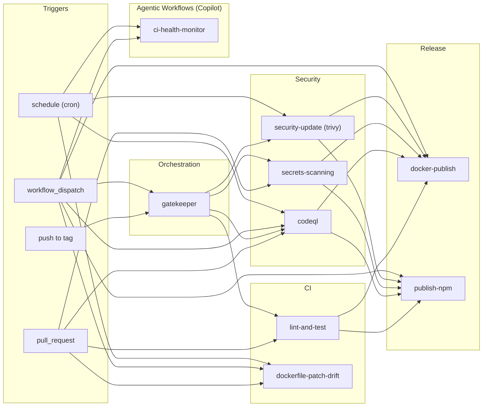

# CI/CD Workflows

This directory contains all GitHub Actions workflows for **mysql-mcp**. The pipeline features three high-performance layers. These are continuous integration, security scanning, and automated publishing.

## Value Proposition
The **mysql-mcp** CI/CD pipeline delivers uncompromising security, high-performance testing, and automated, multi-architecture deployments. Engineered with intelligent agentic workflows and rigorous safety gates, it ensures consistently reliable releases with minimal manual overhead.

## Visualize the Workflow Map


```mermaid
flowchart LR
    subgraph Triggers["Triggers"]
        Tag["push to tag"]
        PR["pull_request"]
        Sched["schedule (cron)"]
        Manual["workflow_dispatch"]
    end

    subgraph Orchestration["Orchestration"]
        Gate["gatekeeper"]
    end

    subgraph CI["CI"]
        LT["lint-and-test"]
        DPD["dockerfile-patch-drift"]
    end

    subgraph Security["Security"]
        CQL["codeql"]
        SS["secrets-scanning"]
        SU["security-update (trivy)"]
    end

    subgraph Release_["Release"]
        DP["docker-publish"]
        NPM["publish-npm"]
    end

    subgraph Agentic["Agentic Workflows (Copilot)"]
        CHM["ci-health-monitor"]
    end

    PR --> LT
    PR --> CQL
    PR --> SS
    PR --> DPD

    Tag --> Gate
    Manual --> Gate

    Gate --> LT
    Gate --> CQL
    Gate --> SS
    Gate --> SU

    LT & CQL & SS & SU --> DP
    LT & CQL & SS & SU --> NPM

    Manual --> NPM
    Manual --> DP
    Manual --> CQL
    Manual --> CHM
    Manual --> DPD

    Sched --> CQL
    Sched --> CHM
    Sched --> SU
    Sched --> DPD
```

---

## Explore the Workflows

### Accelerate with CI

| File                                 | Trigger                 | Purpose                                                                                                  |
| ------------------------------------ | ----------------------- | -------------------------------------------------------------------------------------------------------- |
| [lint-and-test.yml](lint-and-test.yml) | `workflow_call` from gatekeeper / PR    | Lint, typecheck, build, unit tests (supported Node.js versions matrix), pnpm audit, Docker smoke test (build + HTTP start) |
| [dockerfile-patch-drift.yml](dockerfile-patch-drift.yml) | PR / schedule / manual / workflow_call | Detects when manually patched transitive dependencies in the Dockerfile have drifted from npm bundles |

### Secure the Pipeline

| File                                       | Trigger                                   | Purpose                                                               |
| ------------------------------------------ | ----------------------------------------- | --------------------------------------------------------------------- |
| [codeql.yml](codeql.yml)                   | `workflow_call` from gatekeeper / PR / weekly / manual       | CodeQL static analysis for `javascript-typescript` (security-extended and security-and-quality) |
| [secrets-scanning.yml](secrets-scanning.yml) | `workflow_call` from gatekeeper / PR                      | TruffleHog (verified secrets) + Gitleaks scanning                     |
| [security-update.yml](security-update.yml) | `workflow_call` from gatekeeper / schedule / PR / manual | Trivy vulnerability scanning |

### Publish Reliable Releases

| File                                       | Trigger                                            | Purpose                                                                                                                                           |
| ------------------------------------------ | -------------------------------------------------- | ------------------------------------------------------------------------------------------------------------------------------------------------- |
| [docker-publish.yml](docker-publish.yml)   | `workflow_call` from gatekeeper (on tag) / manual   | Security scan (Docker Scout + Trivy), smoke test, multi-arch build, manifest merge, Docker Hub description update                 |
| [publish-npm.yml](publish-npm.yml)         | `workflow_call` from gatekeeper / manual            | Version verification, build, publish to npm with `--provenance` (SLSA Build L3)                                                                   |

### Automate with Agentic Workflows

These are AI-powered workflows using [GitHub Copilot Coding Agent](https://docs.github.com/en/copilot/using-github-copilot/using-copilot-coding-agent-to-work-on-tasks/about-assigning-tasks-to-copilot). Each `.md` file contains the agent prompt. The corresponding `.lock.yml` is the auto-generated compiled workflow (**do not edit `.lock.yml` files**).

| Prompt                                           | Lock File                                                    | Schedule               | Purpose                                                                                 |
| ------------------------------------------------ | ------------------------------------------------------------ | ---------------------- | --------------------------------------------------------------------------------------- |
| [ci-health-monitor.md](ci-health-monitor.md)     | [ci-health-monitor.lock.yml](ci-health-monitor.lock.yml)     | Wed 14:00 UTC / manual | Audits workflows for deprecated actions, Node.js runtime issues, stale Dependabot config |

---

## Understand the Release Pipeline

The full release flow is orchestrated by `gatekeeper.yml` when a tag (e.g., `vX.Y.Z`) is pushed to the repository:

```text
push to tag (v*)
  → gatekeeper
      ├── lint-and-test
      │     ├── lint (supported Node.js versions matrix)
      │     ├── security-scan (pnpm audit)
      │     └── docker-smoke-test (build + HTTP start)
      ├── codeql
      ├── secrets-scanning
      └── trivy (invokes security-update.yml)
            ↓ all safety and security gates pass (blocking requirement)
          ├── docker-publish
          │     ├── security-scan (Docker Scout)
          │     ├── smoke-test (binary load + HTTP start)
          │     ├── build-platform
          │     │     ↓ all platforms built
          │     └── merge-and-push (multi-arch manifest)
          └── publish-npm
                ├── Version verification
                └── Publish to npm with SLSA provenance
```

For releases, the `gatekeeper.yml` workflow orchestrates all CI, security, and publishing steps. `lint-and-test`, `codeql`, `secrets-scanning`, and `trivy` are blocking requirements that must pass before `docker-publish` and `publish-npm` are triggered.

---

## Manage Required Secrets

| Secret            | Used By                    | Purpose                     |
| ----------------- | -------------------------- | --------------------------- |
| `GITHUB_TOKEN`    | codeql, secrets-scanning   | Git operations               |
| `NPM_TOKEN`       | publish-npm                | npm registry authentication  |
| `DOCKER_USERNAME` | docker-publish             | Docker Hub login             |
| `DOCKER_PASSWORD` | docker-publish             | Docker Hub login             |

---

## Follow Editing Guidelines

- **YAML workflows** — edit directly, commit to `main` or via PR
- **Agentic `.md` prompts** — edit the `.md` file, then run `gh aw compile` to regenerate the `.lock.yml`
- **`.lock.yml` files** — **never edit manually**; always regenerate via `gh aw compile`
