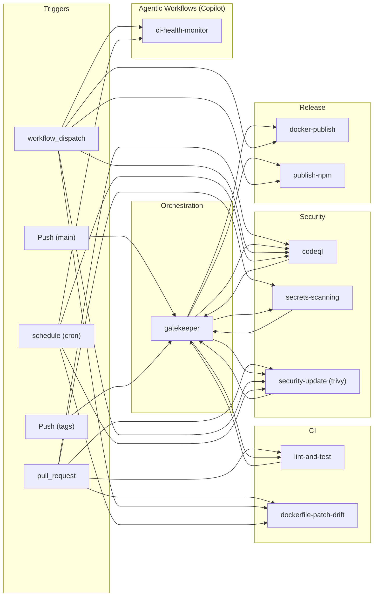

# Automate CI/CD Workflows

## Value Proposition
- **Enterprise Automation:** Streamline CI/CD pipelines to accelerate enterprise delivery.
- **Mission-Critical Reliability:** Enforce rigorous validation for zero-downtime deployments.
- **Zero-Trust Security:** Integrate continuous vulnerability scanning and advanced static analysis.

This directory contains all GitHub Actions workflows for **mysql-mcp**.

## Visualize the Workflow Map


```mermaid
flowchart LR
    subgraph Triggers["Triggers"]
        PushMain["Push (main)"]
        PushTags["Push (tags)"]
        PR["pull_request"]
        Sched["schedule (cron)"]
        Manual["workflow_dispatch"]
    end

    subgraph Orchestration["Orchestration"]
        Gate["gatekeeper"]
    end

    subgraph CI["CI"]
        LT["lint-and-test"]
        DPD["dockerfile-patch-drift"]
    end

    subgraph Security["Security"]
        CQL["codeql"]
        SS["secrets-scanning"]
        SU["security-update (trivy)"]
    end

    subgraph ReleaseGroup["Release"]
        DP["docker-publish"]
        NPM["publish-npm"]
    end

    subgraph Agentic["Agentic Workflows (Copilot)"]
        CHM["ci-health-monitor"]
    end

    PR --> LT
    PR --> CQL
    PR --> SS
    PR --> SU
    PR --> DPD

    PushMain --> Gate
    PushTags --> Gate

    Gate --> LT
    Gate --> CQL
    Gate --> SS
    Gate --> SU

    LT & CQL & SS & SU --> Gate
    Gate --> DP
    Gate --> NPM

    Manual --> NPM
    Manual --> DP
    Manual --> CQL
    Manual --> CHM
    Manual --> SU
    Manual --> DPD

    Sched --> CQL
    Sched --> CHM
    Sched --> SU
    Sched --> DPD
```

---

## Explore the Workflows

### Accelerate with CI

| File                                 | Trigger                 | Purpose                                                                                                  |
| ------------------------------------ | ----------------------- | -------------------------------------------------------------------------------------------------------- |
| [gatekeeper.yml](gatekeeper.yml)     | push to main / tags     | Orchestrates all CI, security, and publishing steps, acting as the primary pipeline blocking requirement. |
| [lint-and-test.yml](lint-and-test.yml) | `workflow_call` from gatekeeper / PR    | Lints, typechecks, builds, and unit tests code. Runs a security scan and smoke tests containers. Provisions live MySQL/Redis service containers for end-to-end integration testing. |
| [dockerfile-patch-drift.yml](dockerfile-patch-drift.yml) | PR / schedule / manual | Detects dependency drift across Dockerfile and package.json overrides. |

### Secure the Pipeline

| File                                       | Trigger                                   | Purpose                                                               |
| ------------------------------------------ | ----------------------------------------- | --------------------------------------------------------------------- |
| [codeql.yml](codeql.yml)                   | `workflow_call` from gatekeeper / PR (main) / weekly / manual       | Runs security-and-quality CodeQL static analysis on JavaScript and TypeScript code. |
| [secrets-scanning.yml](secrets-scanning.yml) | `workflow_call` from gatekeeper / PR                      | Scans for verified secrets using TruffleHog and Gitleaks. |
| [security-update.yml](security-update.yml) | `workflow_call` from gatekeeper / schedule / PR / manual | Scans for vulnerabilities using Trivy. |

### Publish Reliable Releases

| File                                       | Trigger                                            | Purpose                                                                                                                                           |
| ------------------------------------------ | -------------------------------------------------- | ------------------------------------------------------------------------------------------------------------------------------------------------- |
| [docker-publish.yml](docker-publish.yml)   | `workflow_call` from gatekeeper (on tag) / manual   | Builds multi-arch images, scans, and pushes to Docker Hub. Manual runs require emergency bypass. |
| [publish-npm.yml](publish-npm.yml)         | `workflow_call` from gatekeeper (on tag) / manual            | Publishes to npm with SLSA L3 provenance. Manual runs require an explicit emergency bypass. |

### Automate with Agentic Workflows

These are AI-powered workflows using [GitHub Copilot Coding Agent](https://docs.github.com/en/copilot/using-github-copilot/using-copilot-coding-agent-to-work-on-tasks/about-assigning-tasks-to-copilot). Each `.md` file contains the agent prompt. The corresponding `.lock.yml` is the auto-generated compiled workflow (**do not edit `.lock.yml` files**).

| Prompt                                           | Lock File                                                    | Schedule               | Purpose                                                                                 |
| ------------------------------------------------ | ------------------------------------------------------------ | ---------------------- | --------------------------------------------------------------------------------------- |
| [ci-health-monitor.md](ci-health-monitor.md)     | [ci-health-monitor.lock.yml](ci-health-monitor.lock.yml)     | Wed 14:00 UTC / manual | Audits workflows for deprecated actions, Node.js issues, and stale Dependabot configurations. |

---

## Understand the Release Pipeline

The `gatekeeper.yml` workflow orchestrates all CI, security, and publishing steps. It triggers upon push to `main` and tags:

```text
push to main, release tags
  → gatekeeper
      ├── lint-and-test
      │     ├── lint
      │     ├── security-scan (pnpm audit)
      │     └── docker-smoke-test (build + HTTP start)
      ├── codeql
      ├── secrets-scanning
      └── trivy (invokes security-update.yml)
            ↓ all safety and security gates pass (blocking requirement)
          ├── docker-publish
          │     ├── security-scan (Docker Scout + Trivy)
          │     ├── smoke-test (binary load + HTTP start)
          │     ├── build-platform
          │     │     ↓ all platforms built
          │     └── merge-and-push (multi-arch manifest)
          └── publish-npm
                ├── Version verification
                └── Publish to npm with SLSA provenance
```

The `lint-and-test`, `codeql`, `secrets-scanning`, and `security-update (Trivy)` jobs are blocking requirements. They must pass before `docker-publish` and `publish-npm` are triggered.

---

## Manage Required Secrets

| Secret            | Used By                    | Purpose                     |
| ----------------- | -------------------------- | --------------------------- |
| `GITHUB_TOKEN`    | codeql, secrets-scanning, security-update, ci-health-monitor | Git operations and agent authorization |
| `GH_AW_GITHUB_MCP_SERVER_TOKEN`| ci-health-monitor | Agent authorization            |
| `GH_AW_GITHUB_TOKEN` | ci-health-monitor         | Agent authorization            |
| `COPILOT_GITHUB_TOKEN`| ci-health-monitor        | gh copilot engine authorization for agentic workflows |
| `NPM_TOKEN`       | publish-npm                | npm registry authentication  |
| `DOCKER_USERNAME` | docker-publish             | Docker Hub login             |
| `DOCKER_PASSWORD` | docker-publish             | Docker Hub login             |

---

## Follow Editing Guidelines

- **YAML workflows** — edit directly, commit to `main` or via PR
- **Agentic .md prompts** — edit the .md file. Use the provided agent script to regenerate `.lock.yml` files.
- **`.lock.yml` files** — **never edit manually**; always regenerate via the provided agent script
